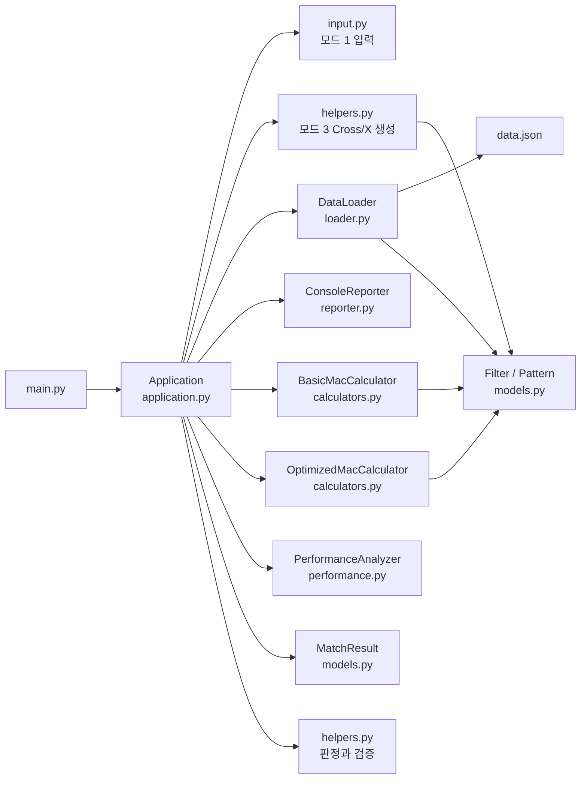
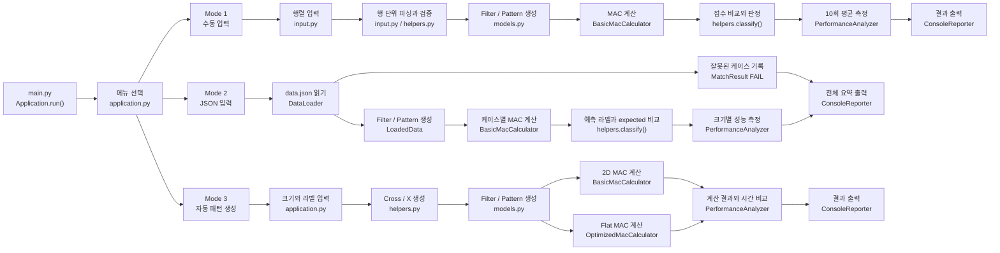

# 프로젝트 구조

## 파일 트리

```text
tiny_mac_cal/
|
|- main.py                         # 프로그램 시작점
|- data.json                       # 모드 2 필터와 패턴 데이터
|- README.md                       # 실행 방법과 프로젝트 요약
|
|- mini_npu/                       # 애플리케이션 패키지
|  |
|  |- __init__.py                  # Python 패키지 선언
|  |- application.py               # 모드 1 / 2 / 3 실행 흐름 조율
|  |- input.py                     # 콘솔 행 파싱과 행렬 재입력
|  |- reporter.py                  # 콘솔 출력 형식화
|  |- loader.py                    # data.json 로드, 검증, 객체 생성
|  |- models.py                    # Filter, Pattern, MatchResult 데이터 객체
|  |- helpers.py                   # 상태 없는 검증, 라벨, 판정, 생성 함수
|  |- calculators.py               # 2D / Flat MAC 계산 전략
|  |- performance.py               # 10회 이상 평균 시간 측정
|
|- tests/                          # 자동화된 unittest 파일
|  |- test_application.py          # 모드 흐름과 결과 요약 테스트
|  |- test_input.py                # 콘솔 행 파싱 테스트
|  |- test_loader.py               # JSON 로드와 오류 격리 테스트
|  |- test_calculators.py          # 2D / Flat MAC 점수 테스트
|  |- test_performance.py          # 반복 시간 측정 테스트
|  |- test_helpers.py              # 검증, epsilon, 생성기 테스트
|
|- docs/
   |- project-structure.md         # 이 구조 설명 문서
   |- superpowers/
      |- specs/                    # 설계 기록
      |- plans/                    # 구현 순서 기록
```

## 런타임 관계



## 모드별 워크플로우



## 파일별 책임

| 파일 | 주요 책임 |
| --- | --- |
| `main.py` | `Application`을 생성하고 프로그램을 시작합니다. |
| `application.py` | 모드를 선택하고 입력, 로드, 계산, 측정, 출력 흐름을 조율합니다. |
| `models.py` | 필터, 패턴, 판정 결과처럼 프로그램 상태가 필요한 데이터를 보관합니다. |
| `calculators.py` | 패턴과 필터의 MAC 점수를 계산합니다. 2D와 Flat 방식이 각각 존재합니다. |
| `performance.py` | 계산 함수 호출만 10회 이상 측정해 평균 시간과 연산 횟수를 만듭니다. |
| `loader.py` | JSON을 읽고 검증해 `Filter`와 `Pattern` 객체를 만듭니다. 케이스별 오류도 분리합니다. |
| `input.py` | 한 행씩 숫자를 읽고, 형식 오류가 난 행만 다시 입력받습니다. |
| `helpers.py` | 행렬 검증, 라벨 정규화, epsilon 판정, Cross/X 생성처럼 상태가 없는 기능을 제공합니다. |
| `reporter.py` | 결과, 성능, 오류, 요약의 콘솔 출력 형식을 한 곳에서 관리합니다. |
| `tests/` | 각 책임 단위와 전체 실행 흐름의 동작을 검증합니다. |

## 클래스 구성

| 클래스 | 위치 | 보관하는 상태 | 주요 역할 |
| --- | --- | --- | --- |
| `Application` | `application.py` | 데이터 파일 경로, 계산기, 측정기, 출력기 | 모드 1/2/3의 전체 흐름을 조율합니다. |
| `Filter` | `models.py` | 라벨, 행렬, 크기 | 비교 기준이 되는 필터 데이터를 표현합니다. |
| `Pattern` | `models.py` | 케이스 ID, 행렬, 크기, 기대 라벨 | 판정할 입력 패턴 데이터를 표현합니다. |
| `MatchResult` | `models.py` | 점수, 판정 라벨, PASS/FAIL, 실패 사유 | 한 번의 필터 비교 결과를 표현합니다. |
| `BasicMacCalculator` | `calculators.py` | 계산기 이름(`2D`) | `matrix[row][column]` 접근으로 MAC 점수를 계산합니다. |
| `OptimizedMacCalculator` | `calculators.py` | 계산기 이름(`Flat`) | 1차원으로 펼친 행렬을 순회해 MAC 점수를 계산합니다. |
| `PerformanceAnalyzer` | `performance.py` | 반복 횟수 | 계산기를 반복 호출해 평균 실행 시간을 측정합니다. |
| `PerformanceMeasurement` | `performance.py` | 계산기 이름, 점수, 평균 시간, 연산 횟수 | 성능 측정 한 건의 결과를 표현합니다. |
| `DataLoader` | `loader.py` | JSON 파일 경로 | JSON을 읽고 스키마를 검증한 뒤 도메인 객체로 변환합니다. |
| `LoadedData` | `loader.py` | 크기별 필터, 정상 패턴, 실패 결과 | 로드가 끝난 데이터를 한 묶음으로 전달합니다. |
| `ConsoleReporter` | `reporter.py` | 출력 함수 | 프로그램의 모든 콘솔 출력 형식을 담당합니다. |

`input.py`, `helpers.py`는 객체 상태를 보관할 필요가 없는 영역입니다. 따라서 입력 행 파싱, 행렬 검증, 라벨 정규화, 판정, 패턴 생성은 클래스가 아니라 독립 함수로 구현했습니다.
