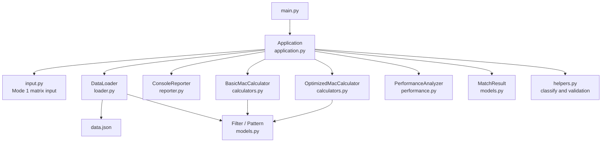

# Project Structure

## File Tree

```text
tiny_mac_cal/
|
|- main.py                         # Program entry point
|- data.json                       # Mode 2 sample filters and patterns
|- README.md                       # Run instructions and assignment summary
|
|- mini_npu/                       # Application package
|  |
|  |- __init__.py                  # Marks this folder as a Python package
|  |- application.py               # Overall mode 1 / mode 2 flow coordinator
|  |- input.py                     # Console row parsing and matrix input retry
|  |- reporter.py                  # All formatted console output
|  |- loader.py                    # data.json reading, validation, object creation
|  |- models.py                    # Filter, Pattern, MatchResult data objects
|  |- helpers.py                   # Stateless validation, labeling, classification,
|  |                               # flattening, and bonus pattern generators
|  |- calculators.py               # 2D and Flat MAC calculation strategies
|  |- performance.py               # 10-run average timing measurement
|
|- tests/                          # Automated unittest files
|  |- test_application.py          # Mode flow and summary tests
|  |- test_input.py                # Console-row parsing tests
|  |- test_loader.py               # JSON loading and bad-case isolation tests
|  |- test_calculators.py          # 2D/Flat MAC score tests
|  |- test_performance.py          # Repeat timing metadata tests
|  |- test_helpers.py              # Validation, epsilon, and generator tests
|
|- docs/
   |- project-structure.md         # This explanation document
   |- superpowers/
      |- specs/                    # Approved design record
      |- plans/                    # Implementation order record
```

## Runtime Relationship



## Responsibility Summary

| File | Main responsibility |
| --- | --- |
| `main.py` | Starts the application. |
| `application.py` | Selects a mode, coordinates collaborators, and builds one `MatchResult` per pattern. |
| `models.py` | Holds domain state only; it does not calculate or print. |
| `calculators.py` | Calculates a MAC score. `Basic` uses `matrix[row][column]`; `Optimized` uses a flat 1D list. |
| `performance.py` | Times only calculation calls at least ten times and computes the average milliseconds. |
| `loader.py` | Loads JSON. Whole-file errors stop mode 2; invalid individual cases become failures. |
| `input.py` | Reads one matrix row at a time and repeats only an invalid row. |
| `helpers.py` | Contains dependency-free logic: matrix checks, label normalization, epsilon decision, and generators. |
| `reporter.py` | Collects all user-facing console formats in one place. |
| `tests/` | Proves the behavior of each responsibility independently and through application flow. |
